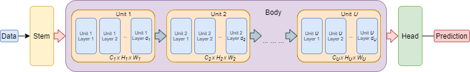
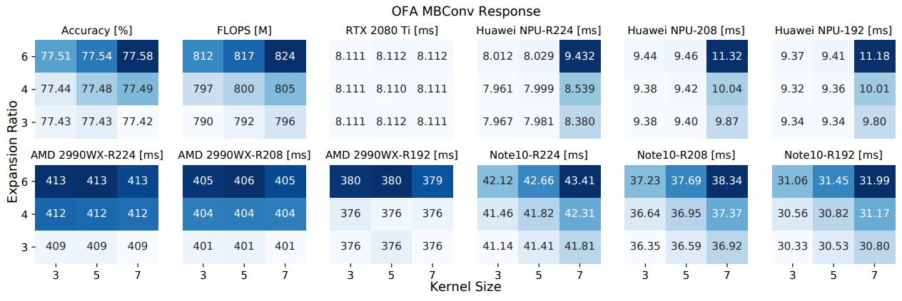

# Profiling Neural Blocks and Design Spaces for Mobile Neural Architecture Search

This code accompanies the paper which has been accepted as an Applied Full Paper at the 30th ACM International 
Conference on Information and Knowledge Management (CIKM `21). The paper is available at [[arXiv:2109.12426]](https://arxiv.org/abs/2109.12426).

In the paper we profile several well-known Design Spaces like Once-for-All (OFA-MBv3), ProxylessNAS and ResNet50 in 
terms of metrics like accuracy or inference latency on a number of target devices, like the Huawei Kirin 9000 NPU, 
Nvidia RTX 2080 Ti GPU, AMD Threadripper 2990WX CPU and Samsung Note10 mobile processor. 

<p align="center">
  
</p>

We can compare the 
profiling results to draw conclusions about different Design Spaces perform on varying hardware, e.g. do specific
operations require more latency, or how sensitive the network is to block choice in different locations.

<p align="center">
  
</p>


### Dependencies
```
python 3.6 or 3.7
pytorch >= 1.4.0
torchvision >= 0.4.0
ofa==0.1.0.post202012082159
torchprofile==0.0.2
```

### Preliminaries:
Data for available in-house predictors (e.g. NPU, GPU and CPU) must be downloaded and used to generate appropriate `.pt` files by training the predictor before profiling can be done.
1. Download the `.csv` files from [Google Drive](https://drive.google.com/drive/folders/1qUqWzc3D3-1LmRxqQiy6u4CRWsmOymuF) and place them in `search/rm_search/data/`
2. For each `.csv` file, run the following command:
```
python -u search/rm_search/run_ofa_op_graph_lat_predictor.py -sub_space <SPACE> -lat_device <DEVICE>
```
Where the value for the `-sub_space` flag is the design space, e.g., `mbv3` or `pn` and the value for the `-lat_device` is the target device, e.g., `npu` or `gpu`. Doing so should place the appropriate `_best.pt` files in `models/Latency/`.

If you have trouble running `run_ofa_op_graph_lat_predictor.py`, see the corresponding README in `search/rm_search`

**Note:** At this time the GPU and CPU predictor data for ResNet50 has not been publicly released.

### Contents: <br/>

This code consists of two parts:

1. Block Profiling, performed using `main.py`
2. Search experiments, performed using scripts in the `/search/rm_search` directory

## Commands to perform profiling

```
python3 main.py
    --space {OFAPred, OFASupernet, ProxylessSupernet, ResNet50Supernet}
    --num_archs 10 # Number of architectures to evaluate per unit-layer-block fix
    --blocks # Can be used to specify individual unit-layer-block combinations to profile, see the block_sample method in each search space for details
    --all # Evaluate all possible unit-layer-block combinations
    --device # Which device, e.g., CPU or GPU, to use
    --metrics # Can specify profiling specific metrics (e.g. only certain latencies), see the metrics field in each file in /search_spaces/ for details
    --data # Location of ImageNet data. Ignored when --fast is specified
    --fast # Use fast RAM imagenet validation data loader, see /models/imagenet_RAM_saver.py for details
    --save # Name of experiment, where to save. Information will be saved in /logs/{Space}/{Save}
    --no-log # Binary; do not log experiment information
```
Output data is formatted to be comma separated such that it can easily be transferred to a CSV file for further processing and analysis if desired, e.g., plotting trends.

### We ask that if you use this code for your research, please cite our [[paper]](https://arxiv.org/abs/2109.12426):
```
@article{mills2021profiling,
  title={Profiling Neural Blocks and Design Spaces for Mobile Neural Architecture Search},
  author={Mills, Keith G and Han, Fred X and Zhang, Jialin and Rezaei, Seyed Saeed Changiz and Chudak, Fabian and Lu, Wei and Lian, Shuo and Jui, Shangling and Niu, Di},
  journal={arXiv preprint arXiv:2109.12426},
  year={2021}
}
```